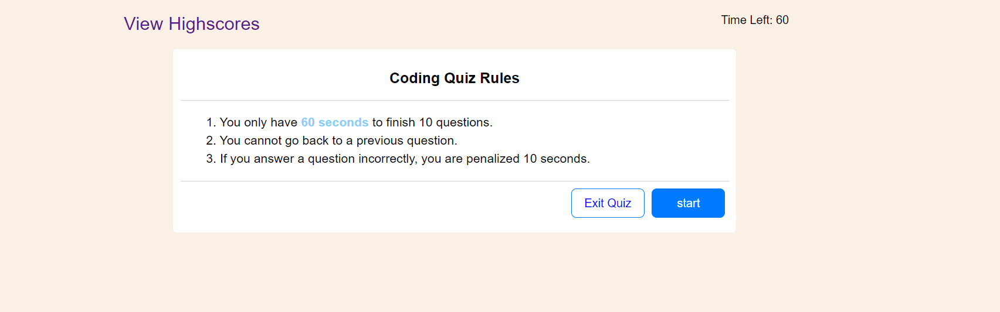
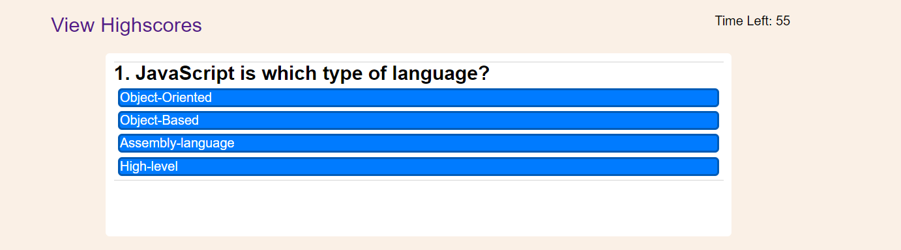
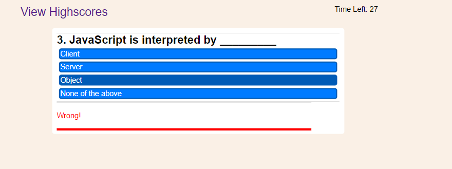
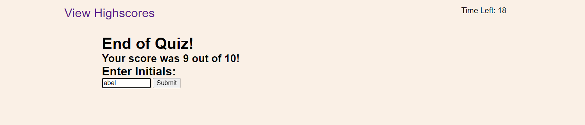
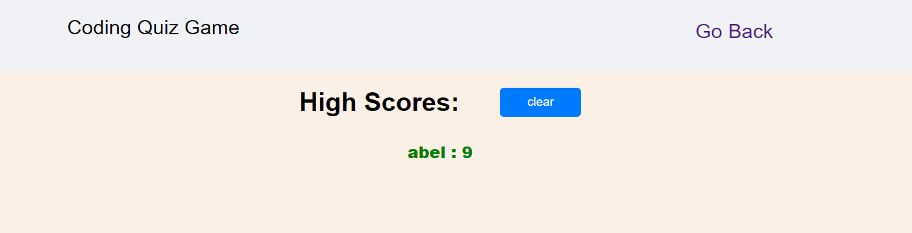

# Web APIs: Code Quiz

## Description

This code quiz involved completing a coding assessment which typically comprises a combination of multiple-choice questions and interactive challenges. The goal was to build a timed code quiz with multiple-choice questions. This app runs in the browser and features dynamically updated HTML and CSS powered by your JavaScript code. It also features a clean and polished UI and is responsive, ensuring that it adapts to multiple screen sizes.

## Installation

first of all you need to have Node invironment in your local machine to run javascript file

step 1 : clone my repository to your local machine

step 2 :  open in terminal if you are in mac or linux operating system or in command prompt if you are in window

step 3 : type this command  ( cd WEB_API_QUIZ_CHALLENGE_4 ) to navigate to the project

step 4 : type this command ( code .) this helps to open in VS code

step 5 : when you are in VS code click the terminal tab from the VS code to open a terminal from VS code

step 6 : then type git status or git branch and make sure you are on the main branch

step 7 : finally go to the index.html run it . just open it using live server and see the result

step 8 : now read Coding Quiz Rules

step 9 : click start button to start the exam

step 10 : you will be asked to to answer the question from the given options

step 11 : you should select one option  to pass to the next question

step 12 : after you finish your quiz exam you will see your result

step 13 : finally you will be asked to enter intials name just to save your score

step 14 :  after you submit your scored value you can click the highscore link to see your scored vales

step 15 :  when you go to the highscore page you can click clear button to clear your previous score just to start again

that's it !

Screenshots!

**Done!  congratulations**

## License

you can clone and use this code for your own task

Access application here :

---
